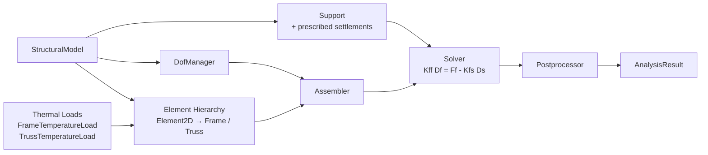
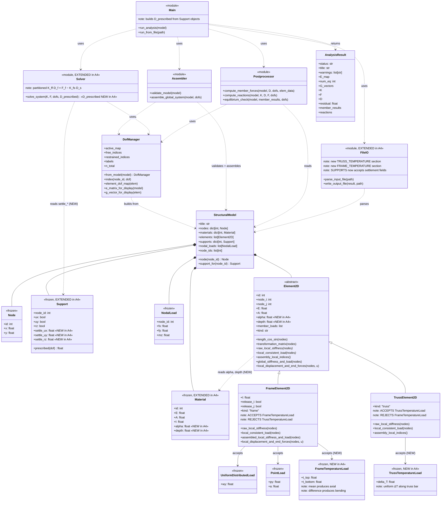

# CE4011 Assignment 4 - 2D Structural Analysis Program



**Ali Utku Tekin - 2744076**  
MSc. Structural Engineering, 3rd Semester | Spring 2025-2026

This package extends the Assignment 3 2D frame-truss solver with the two capabilities required by Assignment 4:

1. **Thermal loading**
   - `TrussTemperatureLoad` for uniform temperature change in truss members
   - `FrameTemperatureLoad` for top/bottom-fiber temperatures in frame members, with the mean-temperature axial effect and the through-depth gradient bending effect derived internally
2. **Support settlements**
   - prescribed displacements at restrained support DOFs handled through the partitioned system
     `K_ff * D_f = F_f - K_fs * D_s`


## Final submission (CE 4011)

**Purpose.** A 2D structural-analysis program for plane frames and trusses based
on the Direct Stiffness Method, with a pure-Python computational engine and a
PyQt6 GUI. It computes displacements, member internal forces (N/V/M), and support
reactions, and visualizes the deformed shape and force diagrams. It also supports
thermal loads, support settlements, load combinations, and modal analysis.

**Install** (Python ≥ 3.11):

```bash
python -m venv .venv && source .venv/bin/activate   # Windows: .venv\Scripts\activate
pip install -e ".[dev]"     # or: pip install numpy scipy matplotlib PyQt6 pytest
```

Full steps and troubleshooting: [`docs/installation_manual.md`](docs/installation_manual.md).

**Run the CLI solver:**

```bash
python -m structural_analysis.main examples/final_demo/demo_portal_frame.txt
```

**Launch the GUI:**

```bash
python -m structural_analysis.gui_qt
```

**Run the tests** (~670 tests; GUI smoke tests need an offscreen Qt platform):

```bash
QT_QPA_PLATFORM=offscreen python -m pytest -q
```

**Where things are:**

| What | Location |
|------|----------|
| Final demo examples (portal frame, cantilever, backup) | [`examples/final_demo/`](examples/final_demo/) |
| Demo example outputs | [`examples/final_demo/outputs/`](examples/final_demo/outputs/) |
| Project report | [`report/final_project_report.md`](report/final_project_report.md) (+ `.pdf`) |
| Installation manual | [`docs/installation_manual.md`](docs/installation_manual.md) |
| User manual | [`docs/user_manual.md`](docs/user_manual.md) |
| Verification (vs. hand calc) | [`docs/verification/final_verification.md`](docs/verification/final_verification.md) |
| UML / architecture | [`docs/uml/`](docs/uml/) (`class_diagram.mmd`, `.dot`, `.png`, `architecture.md`) |
| Video outline / checklists | [`docs/final_video_outline.md`](docs/final_video_outline.md), [`docs/final_video_checklist.md`](docs/final_video_checklist.md), [`docs/final_submission_checklist.md`](docs/final_submission_checklist.md) |
| Demo video link | [`video_link.txt`](video_link.txt) |

**Known limitations.** 2D only; linear-elastic; static + modal analysis (no
nonlinearity, P-Δ, dynamics, or design-code checks); self-weight on rigid end
zones is neglected. See the report's limitations section for the full list.

---

## UML


## Package contents

- `structural_analysis/` - source code
- `tests/` - automated tests
- `inputs/` - Assignment 4 Q2 input files
- `outputs/` - generated console/text outputs for the reported Q2 runs
  


## OOP / architecture highlights

- `Element2D` is the abstract base class for all structural members.
- `FrameElement2D` and `TrussElement2D` specialize stiffness, compatible load handling, and force recovery polymorphically.
- `Material` stores `E`, `A`, `I`, `alpha`, and `depth` because the thermal expansion coefficient and the section depth are intrinsic material/section properties, not properties of a specific load.
- Strict validation rejects incompatible thermal load-element combinations with a clear `TypeError`.
- Support settlements are modeled as prescribed restrained-DOF displacements rather than fake external loads.

## How to run

From the package root:

```bash
python -m structural_analysis.main inputs/q2a_settlement.txt
python -m structural_analysis.main inputs/q2b_thermal.txt
python -m pytest -q
```

## Current automated test status

The included suite contains **59 automated tests**, all passing:

- 53 preserved Assignment 3 tests
- 6 new Assignment 4 tests (4 unit, 2 integration)

## Input format notes

### `MATERIALS`

```text
MATERIALS n
<id> <A> <I> <E> [alpha] [depth]
```

### `SUPPORTS`

```text
SUPPORTS n
<node_id> <ux_fix> <uy_fix> <rz_fix> [settle_ux settle_uy settle_rz]
```

### `FRAME_TEMPERATURE`

```text
FRAME_TEMPERATURE n
<element_id> <t_top> <t_bottom>
```

### `TRUSS_TEMPERATURE`

```text
TRUSS_TEMPERATURE n
<element_id> <delta_T>
```

## Assignment 4 modeling note for Q2(b)

The reported Q2(b) solution uses the **standard centerline idealization**. The thermal gradient of the concrete beam is modeled explicitly with `t_top = 0` and `t_bottom = +50`, which gives both a mean-temperature axial effect and a bending-gradient effect. Any secondary eccentricity between the beam centroidal axis and the bottom-fiber truss attachment is neglected as a higher-order refinement.

## GitHub

The public repository for this assignment lives at:

`https://github.com/tekcentu/StructureGUI`

Update the report cover page accordingly.
