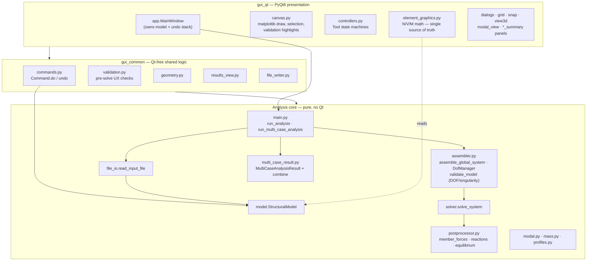
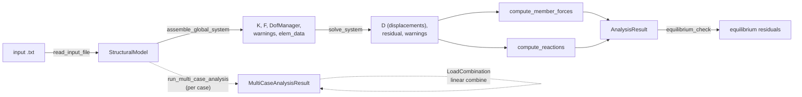
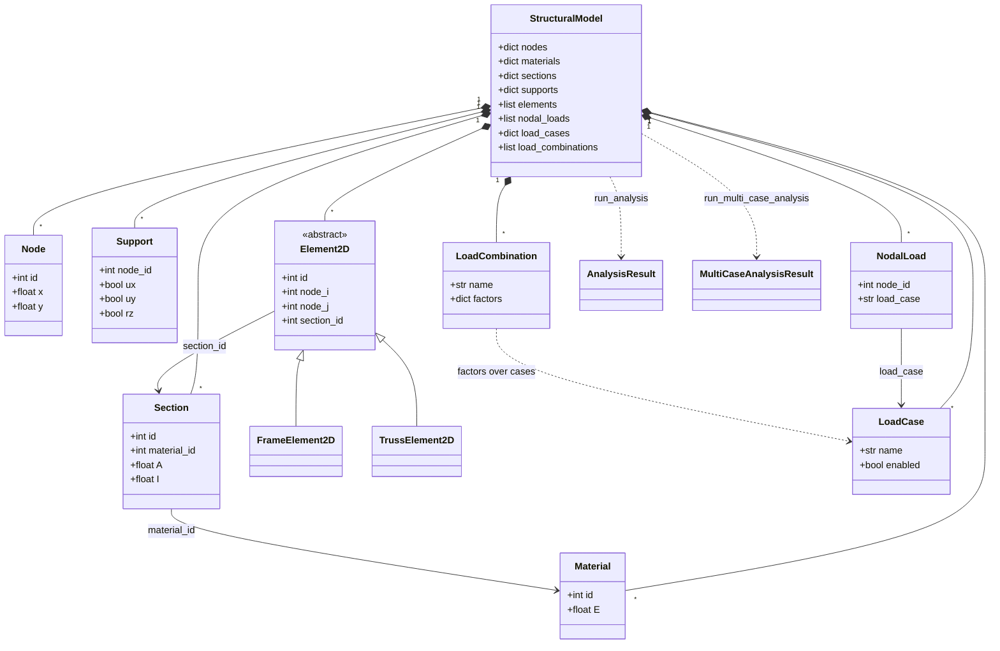
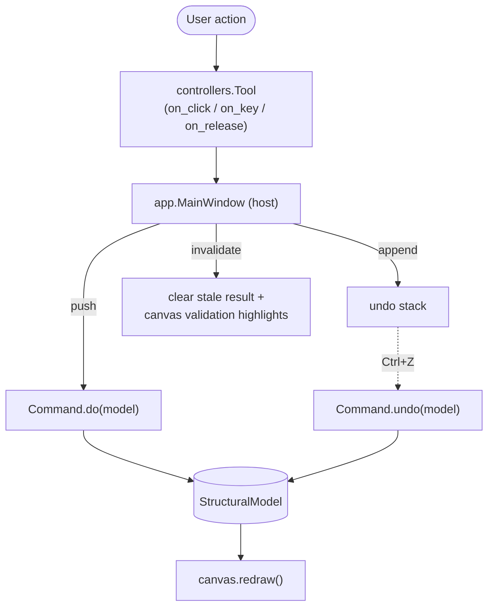

# Architecture

Diagrams of the `structural_analysis` package: the layered design, the
analysis pipeline, the domain model, and the GUI command/undo flow.

All diagrams are [Mermaid](https://mermaid.js.org/) — they render natively on
GitHub and in most IDEs.

---

## 1. Layered architecture

A pure analysis core with two layers of GUI on top. `CLAUDE.md` enforces the
boundary: GUI-scoped PRs may not modify the solver / model / I/O core.

---

## 2. Analysis pipeline (data flow)

The single-case solve path through the core, as orchestrated by
`main.run_analysis`.

---

## 3. Domain model (class diagram)

Frozen dataclasses hang off `StructuralModel`. `Element2D` is the abstract base
for the two element kinds.

---

## 4. GUI command / undo flow

Every model mutation in the GUI goes through a `Command` so it can be undone.
`app.MainWindow` owns the model and the undo/redo stacks.

---

## Invariants worth knowing

- **N/V/M math lives only in `gui_qt/element_graphics.py`** (`evaluate_internal_force`,
  `sample_internal_force`, `internal_force_at`). Every diagram caller routes through it;
  the `dM/dx = V` sign convention is tested only there.
- **Two `validate_model` functions, on purpose:** `assembler.validate_model` (core
  DOF/singularity check) vs. `gui_common.validation.validate_model` (pre-solve UX pass
  that highlights problems on the canvas). Different layers.
- **GUI changes bump the version:** any visible GUI change sets `__version__` and
  `__what_is_new__` in `structural_analysis/__init__.py` (currently `0.22.0`).
- **Solver isolation:** GUI-scoped PRs must not touch `solver`, `assembler`,
  `postprocessor`, `modal`, `element`, `model`, `profiles`, `file_io`, `mass`,
  `gui_common/{file_writer,commands}`, `project_io`, `main`, or `inputs/*.txt`.
