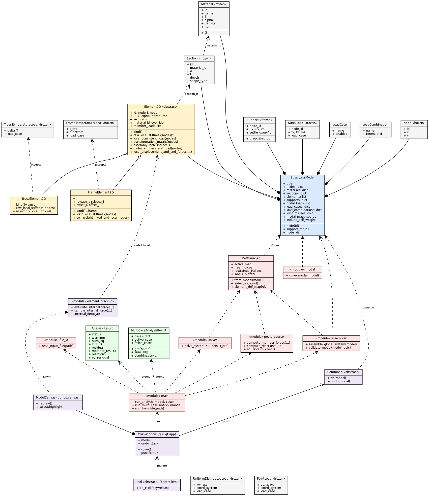

<!-- ============================================================ -->
<!-- COVER PAGE  (placeholder — fill in before exporting)         -->
<!-- ============================================================ -->

# CE 4011 — Final Project Report
## A 2D Structural Analysis Program (Direct Stiffness Method) with a PyQt6 GUI

**Course:** CE 4011 — [course title]
**Student:** [Name Surname]
**Student ID:** [ID]
**Department / Program:** MSc Structural Engineering
**Submission date:** [date]
**Repository:** [GitHub URL]

<!-- Insert a model screenshot here for the cover if desired. -->

<div style="page-break-after: always;"></div>

---

## 1. Introduction

This project is a two-dimensional structural-analysis program built on the
**Direct Stiffness Method (DSM)**. It analyses plane frames and trusses under
mechanical loads, thermal loads, and prescribed support settlements, and it
reports displacements, member internal forces, and support reactions together
with a full set of visual diagrams.

The software has two faces over one shared engine:

- a **pure-Python computational engine** (NumPy/SciPy, no GUI dependency), and
- an interactive **PyQt6 desktop GUI** for drawing models and visualizing
  results, plus a **command-line interface** for reproducible batch runs.

The engine is written with object-oriented programming so that the two element
types (frame and truss) share one interface but specialize their own mechanics.
The design goal was correctness first (every result is checked against
equilibrium and, where possible, closed-form solutions) and a clean separation
between the analysis core and the presentation layer.

---

## 2. Scope of the software

**Structural systems analysed**

- 2D **frames** (beam-columns with axial + flexural stiffness, 3 DOF/node:
  `ux`, `uy`, `rz`).
- 2D **trusses** (axial-only members; rotational DOFs are omitted automatically
  at pure-truss nodes).
- **Mixed** frame/truss models in one structure.

**Modelling features**

- Point loads, full-length uniformly distributed loads (local / global /
  gravity direction), and nodal forces and moments.
- **Moment releases** (internal hinges) at member ends via static condensation.
- **Rigid end offsets** (rigid joint zones) on frame members.
- **Thermal loads:** frame members take top/bottom-fibre temperatures (mean →
  axial effect, gradient → bending); truss members take a uniform `ΔT`.
- **Support settlements** as prescribed restrained-DOF displacements.
- **Self-weight** as an optional automatic load.
- **Load cases and load combinations** (combinations formed by superposition).
- **Modal analysis** (natural frequencies / mode shapes) with consistent or
  lumped mass and user joint masses.

**Outputs**

- Nodal displacements, member end forces, support reactions.
- Bending-moment, shear-force, and axial-force diagrams; deformed shape.
- Equilibrium check and assembly/solve diagnostics.
- CSV export of internal forces at 21 stations per member.

**Out of scope (honest boundaries):** 3D analysis, material/geometric
nonlinearity, dynamic time-history, P-Δ effects, and design-code checking.

---

## 3. Theoretical background

The program implements the **displacement (stiffness) method** for linear
elastic skeletal structures.

**Element stiffness.** Each 2-node member has 6 local DOFs
`[u_i, v_i, θ_i, u_j, v_j, θ_j]`. The frame element uses the standard
beam-column matrix with `EA/L` axial terms and the `12EI/L³`, `6EI/L²`,
`4EI/L`, `2EI/L` flexural terms; the truss element keeps only the axial `EA/L`
terms.

**Transformation.** A 6×6 rotation matrix `R = diag(T, T)` (with the planar
`T = [[c, s, 0], [−s, c, 0], [0, 0, 1]]`, `c = cosθ`, `s = sinθ`) maps local to
global: `k_global = Rᵀ k_local R`, and likewise for the consistent load vector.

**Assembly.** Element contributions are scattered into the global stiffness
matrix `K` and load vector `F` using each element's DOF address vector. Loads
are stored as **energy-consistent equivalent nodal forces** `p` (added to `F`),
and recovered with `q = k·d − p`.

**Boundary conditions and settlements.** The system is partitioned into free
(`f`) and restrained (`s`) DOFs:

```
[K_ff  K_fs] [D_f]   [F_f]
[K_sf  K_ss] [D_s] = [F_s + R]
```

Solving the free partition gives `K_ff · D_f = F_f − K_fs · D_s`, where `D_s`
holds the prescribed support settlements (zero for ordinary supports). Reactions
follow from `R = K·D − F` at the restrained DOFs. This treats settlement
**physically** as a prescribed displacement, not as a fictitious load or a large
spring.

**Thermal loads.** A restrained temperature change produces fixed-end forces.
For a uniform change, `N_T = E·A·α·ΔT`; for a through-depth gradient on a frame,
`M_T = E·I·α·(t_bottom − t_top)/depth`. These enter as additional consistent
load terms.

**Singularity detection.** Before solving, the free stiffness block is checked
by SVD; a rank deficiency is reported as an instability with the dominant
mechanism DOFs, rather than crashing.

**Modal analysis.** The generalized eigenproblem `K φ = ω² M φ` is solved (with
massless rotational DOFs condensed out) for natural frequencies and mode shapes.

---

## 4. Software architecture and class diagrams

The program is organized into three strictly layered packages with a one-way
dependency `gui_qt → gui_common → engine`:

| Layer | Package | Responsibility |
|-------|---------|----------------|
| Computational engine | `structural_analysis/*.py` | model, elements, assembly, solve, post-processing, modal |
| Editor (Qt-free shared logic) | `structural_analysis/gui_common/` | undoable commands, pre-solve validation, file writer |
| GUI (presentation) | `structural_analysis/gui_qt/` | PyQt6 window, canvas, tools, dialogs, diagram drawing |

*(The assignment brief's `solver/` / `editor/` / `gui/` correspond to these
three real packages; the mapping is documented in
[`docs/uml/architecture.md`](../docs/uml/architecture.md).)*

The class diagram below is reproduced from
[`docs/uml/class_diagram.mmd`](../docs/uml/class_diagram.mmd) (a Graphviz
version and rendered PNG are in [`docs/uml/`](../docs/uml/)).



### 4.1 Use of OOP in the computational engine

- **`Element2D` (abstract base)** defines the shared 6-DOF interface:
  `raw_local_stiffness`, `local_consistent_load`, `transformation_matrix`,
  `assembly_local_indices`, `global_stiffness_and_load`, and
  `local_displacement_and_end_forces`.
- **`FrameElement2D`** and **`TrussElement2D`** override these polymorphically:
  the frame builds the full flexural matrix, handles moment releases and rigid
  offsets, and accepts `FrameTemperatureLoad`; the truss builds an axial-only
  matrix, marks its rotational DOFs inactive, and accepts `TrussTemperatureLoad`.
- The assembler iterates over the abstract type and calls
  `element.global_stiffness_and_load(...)` without knowing the concrete subtype
  — this is the **polymorphism payoff**: one assembly loop serves every member
  kind, and a new element type would slot in by subclassing `Element2D`.
- **Type safety by design:** applying a `TrussTemperatureLoad` to a frame (or
  vice-versa) raises `TypeError`, so a modelling mistake fails loudly instead of
  producing a quietly wrong answer.

### 4.2 Major classes — purpose and relationships

| Class / module | Responsibility | Key relationships |
|----------------|----------------|-------------------|
| `StructuralModel` | aggregate root holding all model data | *composes* nodes, materials, sections, supports, elements, loads, cases |
| `Node`, `Material`, `Section`, `Support` | frozen value objects | `Section → Material`, `Element2D → Section` |
| `Element2D` → `FrameElement2D`, `TrussElement2D` | element mechanics | inherit `Element2D`; read `Material`/`Section` data |
| load classes (`NodalLoad`, `UniformDistributedLoad`, `PointLoad`, `*TemperatureLoad`) | applied actions | attached to model / elements |
| `DofManager` | builds equation numbering, omits unused rotational DOFs | built from `StructuralModel`; used by assembler/solver/post |
| `assembler` | validates connectivity, assembles `K`, `F` | uses `DofManager`, `Element2D` |
| `solver` | partitioned solve + SVD singularity check + settlements | uses `DofManager` |
| `postprocessor` | member forces, reactions, equilibrium check | uses `DofManager`, `StructuralModel` |
| `main` | orchestrates the pipeline; per-case filtering | calls file_io → assembler → solver → postprocessor |
| `AnalysisResult` / `MultiCaseAnalysisResult` | structured result containers; superposition | returned by `main` |
| `modal` | eigen-analysis | reads `StructuralModel`, mass matrices |
| `Command` (+ ~40 subclasses) | one undoable model mutation each | `do(model)` / `undo(model)` |
| `MainWindow`, `ModelCanvas`, `Tool` subclasses | GUI window, drawing, input tools | mutate model via `Command`; draw via `element_graphics` |
| `element_graphics` | single source of truth for N/V/M diagram math | reads element end forces |

---

## 5. Input and output structure

### 5.1 Input

Models can be created in the GUI (drawing tools + dialogs) or written as a
plain-text input file parsed by `file_io.read_input_file`. The text format is
section-based; key sections:

```
TITLE
<one-line title>

NODES n
<id> <x> <y>

MATERIALS n
<id> <E> [alpha] [density] [name]          # paired with a SECTIONS block
                                            # (legacy: <id> <A> <I> <E> [alpha] [depth])
SECTIONS n
<id> <material_id> <A> <I> [depth] [name]

ELEMENTS n
<id> <node_i> <node_j> <section_id> [FRAME|TRUSS] [START|END|BOTH]

SUPPORTS n
<node_id> <ux> <uy> <rz> [settle_ux settle_uy settle_rz]

LOADS n
<node_id> <Fx> <Fy> <Mz>

MEMBER_UDL n / MEMBER_POINT_LOADS n
FRAME_TEMPERATURE n / TRUSS_TEMPERATURE n
```

Lines beginning with `#` are comments; bad tokens (unknown keys, malformed
numbers, dangling references) raise descriptive `ValueError`s rather than being
silently ignored. The GUI's native project format is `.spa.json`, which stores
the model text plus the view/grid/selection state.

### 5.2 Output

The CLI prints a structured report with these stages: input echo, equation
numbering (the `E` matrix and per-element `G` vectors), the assembled `K` and
`F`, the solve (residual + nodal displacements), member end forces, support
reactions, an equilibrium check, and a storage report. The GUI shows the same
information graphically (see §7) and can export per-member internal forces to
CSV. Reference outputs for the demo models are committed under
`examples/final_demo/outputs/`.

---

## 6. Analysis procedure

The single-case pipeline (`main.run_analysis`) runs these steps:

1. **Read / receive the model** — from a file (`read_input_file`) or from the
   live GUI model.
2. **Number the DOFs** — `DofManager.from_model` assigns equation numbers and
   omits rotational DOFs where no member supplies bending stiffness.
3. **Validate** — connectivity (DFS for floating components), non-positive
   properties, zero-length members, coincident nodes.
4. **Assemble** — scatter each element's `k_global`, `p_global` into `K`, `F`;
   add nodal loads and (optionally) self-weight.
5. **Apply boundary conditions / settlements** — build the prescribed-
   displacement vector `D_s`.
6. **Solve** — `K_ff · D_f = F_f − K_fs · D_s`, after an SVD rank check.
7. **Recover member forces** — `q = k·d − p` in local coordinates per element.
8. **Compute reactions** — `R = K·D − F` at restrained DOFs.
9. **Check equilibrium** — sum element end forces at every free node; residuals
   are reported (typically ~1e-13).

For multiple load cases, `run_multi_case_analysis` runs step 1–9 per case and
`MultiCaseAnalysisResult` superposes them for load combinations (exact, because
the solver is linear).

---

## 7. Result visualization and post-processing

In the GUI, results are drawn as overlays on the model canvas, all toggled from
the results panel:

- **Deformed shape** (with an adjustable visual amplification scale).
- **Internal-force diagrams** — bending moment (M), shear (V), and axial (N),
  selectable per result.
- **Support reactions** — forces and moments at restrained nodes.
- **Hover read-out** — the internal force value at the cursor's position along a
  member, and a per-member detail dialog with end forces and the full N/V/M
  plot.

Crucially, **all** diagram values flow through one routine,
`element_graphics.evaluate_internal_force` /
`sample_internal_force` / `internal_force_at`, so the hover read-out, the canvas
diagram, and the detail dialog can never disagree. The `dM/dx = V` sign
convention is defined and unit-tested in exactly that one place. Internal forces
can also be exported to CSV at 21 stations per member for comparison against
external tools such as SAP2000.

---

## 8. Verification examples

The solver was verified against closed-form hand calculations. Full details and
the reproduction commands are in
[`docs/verification/final_verification.md`](../docs/verification/final_verification.md);
the headline result for the steel cantilever (`L = 4 m`, tip load `P = 10 kN`,
`EI = 4074 kN·m²`) is:

| Quantity | Our Program | Reference (hand) | Difference | Status |
|----------|-------------|------------------|------------|--------|
| Tip deflection `PL³/3EI` (m) | −5.236459e−02 | −5.236460e−02 | < 0.001 % | ✅ |
| Tip rotation `PL²/2EI` (rad) | −1.963672e−02 | −1.963672e−02 | < 0.001 % | ✅ |
| Fixed-end moment `PL` (kN·m) | 40.0000 | 40.0000 | 0.0 % | ✅ |
| Base shear `P` (kN) | 10.0000 | 10.0000 | 0.0 % | ✅ |
| Base reaction `Rᵧ` (kN) | 10.0000 | 10.0000 | 0.0 % | ✅ |

A simply-supported beam (central point load) gives reactions `5 kN` each, end
rotation `PL²/16EI = 0.0153413 rad`, and midspan moment `PL/4 = 25 kN·m`, all
matching the program. Both models pass the internal equilibrium check at machine
precision. The verification exercises every stage of the pipeline: stiffness
assembly, boundary conditions, load-vector formation, solution, force recovery,
and post-processing sign conventions.

The program is additionally backed by an automated test suite of ~670 tests
(`pytest`) covering the engine, the command/undo layer, validation, and GUI
smoke tests.

---

## 9. Limitations and possible improvements

**Current limitations (stated honestly):**

- **2D only** — no out-of-plane or 3D analysis; `nu`, `J`, and the section
  width/shape fields are stored but not consumed by the 2D solver.
- **Linear elastic only** — no material or geometric nonlinearity, no P-Δ, no
  buckling.
- **Static + modal** — no dynamic time-history or response-spectrum analysis.
- **No design checks** — the program reports demands, not code utilization.
- **Self-weight on rigid end zones** is neglected (the rigid offset zones carry
  no distributed self-weight in the current version — a documented modelling
  approximation).
- **Two `validate_model` functions** (core vs. GUI UX) share a name across
  layers; correct by design but a potential point of confusion.
- **`element_graphics`** (a GUI-package module) holds the N/V/M mechanics rather
  than the engine; intentional and tested, but it places one piece of mechanics
  outside the engine package.

**Possible improvements:**

- Extend to 3D frames/trusses (the DOF and transformation machinery generalizes
  naturally).
- Add P-Δ / geometric stiffness and basic nonlinear capability.
- Add response-spectrum / time-history dynamics on top of the existing modal
  solver.
- Sparse/banded storage for large models (the storage report already estimates
  the bandwidth savings).
- Optional design-code post-processing (steel/concrete checks).

---

## 10. References

1. K.-J. Bathe, *Finite Element Procedures*, Prentice Hall.
2. R. C. Hibbeler, *Structural Analysis*, Pearson.
3. A. Kassimali, *Matrix Analysis of Structures*, Cengage.
4. W. McGuire, R. H. Gallagher, R. D. Ziemian, *Matrix Structural Analysis*,
   Wiley.
5. NumPy and SciPy documentation — https://numpy.org , https://scipy.org
6. Project source code and tests — `structural_analysis/`, `tests/` (this
   repository).

---

<!-- ============================================================ -->
<!-- HOW TO EXPORT THIS REPORT TO PDF                              -->
<!-- ============================================================ -->

> **Exporting to PDF.** The repository already includes a Markdown→PDF renderer
> (`docs/render_proposal_pdf.py`, using `markdown` + `weasyprint`). To produce
> `report/final_project_report.pdf`, either:
>
> 1. **Reuse the existing renderer** (recommended). With the venv active and
>    `pip install markdown weasyprint`:
>    ```bash
>    python - <<'PY'
>    import markdown
>    from weasyprint import HTML, CSS
>    from pathlib import Path
>    src = Path("report/final_project_report.md")
>    css = Path("docs/render_proposal_pdf.py").read_text().split('CSS_TEXT = """')[1].split('"""')[0]
>    html = markdown.markdown(src.read_text(encoding="utf-8"),
>                             extensions=["tables","fenced_code","sane_lists"])
>    HTML(string=f"<!doctype html><meta charset=utf-8><body>{html}</body>",
>         base_url="report").write_pdf("report/final_project_report.pdf",
>                                      stylesheets=[CSS(string=css)])
>    print("wrote report/final_project_report.pdf")
>    PY
>    ```
> 2. **Or** use any Markdown editor (VS Code "Markdown PDF", Typora, or
>    `pandoc final_project_report.md -o final_project_report.pdf`).
>
> A `weasyprint`-rendered PDF is committed alongside this file when the tooling
> is available in the build environment; otherwise this Markdown source is the
> authoritative report.
