# 2D Frame and Truss Structural Analysis Program with GUI

**CE 4011 — Assignment 4 Final Report**

Ali Utku Tekin · 2744076

MSc Structural Engineering, 3rd Semester · Spring 2025–2026

Repository: https://github.com/tekcentu/StructureGUI

Package version: 0.40.2

---

## Abstract

This report describes the design, implementation, and verification of a Python program
for the **linear-elastic, small-displacement static analysis of 2D frames and trusses**,
delivered as a layered software package with a pure analysis core (NumPy/SciPy) and a
PyQt6 graphical user interface on top. The solver follows the **direct stiffness
method** with a partitioned solution
`K_ff · D_f = F_f − K_fs · D_s`, so prescribed support settlements are
handled as true restrained-DOF displacements rather than equivalent loads. The program
supports point and uniformly-distributed member loads, nodal loads, thermal loading,
multiple load cases, linear load combinations, and reports displacements, support
reactions, member-end forces, and continuous N/V/M station diagrams.

The GUI lets the user draw a model interactively, assign supports / sections / loads,
run the solve, and inspect deformed shape and N/V/M diagrams in the user's preferred
unit preset (kN/m, kgf/cm, kip/ft, etc.). All model mutations go through an undoable
`Command` so the user can experiment safely. The implementation is covered by **1136
non-smoke automated tests** (all passing) plus an offscreen-Qt GUI smoke suite, and
selected outputs are checked against textbook closed-form solutions to within
machine precision.

---

## 1. Introduction

Hand calculations and spreadsheet-based stiffness methods become impractical above the
simplest frames; an automated program lets the engineer focus on modelling decisions
(connectivity, supports, loading, units) instead of bookkeeping. Even a small project
gains from a GUI: snap-to-grid drawing prevents coordinate typos, on-canvas validation
catches mechanisms before they reach the solver, and on-screen N/V/M diagrams make
behaviour interpretable in a way that a column of numbers does not.

This program targets **2D plane systems** — frames (axial, shear, bending) and trusses
(axial only) — with the assumptions standard for an introductory matrix-stiffness
course: linear elasticity, small displacements, perfectly straight prismatic members,
and homogeneous isotropic material. Within those limits it is meant to be (a)
**correct** — verifiable against textbook formulas; (b) **honest** — sign conventions
documented and enforced by tests; and (c) **safe** — invalid models are caught with
clear messages instead of silently producing a number.

---

## 2. Structural System and Analysis Method

### 2.1 Modelled system

The package solves planar (x, y) structures composed of two kinds of one-dimensional
elements:

| Element kind          | DOFs at each end | Internal forces returned |
|-----------------------|------------------|--------------------------|
| `FrameElement2D`      | u\_x, u\_y, r\_z | N, V, M                  |
| `TrussElement2D`      | u\_x, u\_y       | N only                   |

Nodes carry three displacement DOFs in the global frame: u\_x, u\_y, and r\_z (about
the out-of-plane axis). A truss element ignores rotational DOFs internally; the
assembler simply does not add stiffness to the r\_z rows/columns of its end nodes,
which is why a truss may show as kinematically unstable until at least one frame
member or rotation-restraint pins its rotational DOFs.

### 2.2 Direct Stiffness Method workflow

```
input .txt → StructuralModel
       → assemble_global_system → (K, F, DofManager, warnings, elem_data)
       → solve_system → D, residual
       → compute_member_forces → f_local per element
       → compute_reactions   → R per restrained DOF
       → equilibrium_check   → free-DOF residual norm
```

The free vs. restrained partition is built once by `assembler.DofManager`, which
assigns equation numbers per (node, dof) and keeps the mapping for post-processing.
The global system, partitioned into free (f) and supported (s) blocks, reads

```
[ K_ff   K_fs ] [ D_f ]   [ F_f ]
[ K_sf   K_ss ] [ D_s ] = [ F_s ]
```

and is solved as

```
K_ff · D_f = F_f − K_fs · D_s              (free DOFs)
R          = K_sf · D_f + K_ss · D_s − F_s  (support reactions)
```

where `D_s` is the vector of **prescribed restrained-DOF displacements** (zero except
where the user specified a support settlement). This matters because settlements are
*not* applied as fake nodal loads — that would be a workaround. The partitioned form
above is what the solver actually computes (`structural_analysis/solver.py`).

### 2.3 Element stiffness and coordinate transformation

Each frame element contributes its 6 × 6 local stiffness matrix:

```
              [   EA/L         0          0       −EA/L        0          0     ]
              [    0       12EI/L^3    6EI/L^2       0      −12EI/L^3    6EI/L^2    ]
              [    0        6EI/L^2    4EI/L        0       −6EI/L^2    2EI/L     ]
  k_local =   [  −EA/L        0          0        EA/L        0          0      ]
              [    0      −12EI/L^3   −6EI/L^2       0       12EI/L^3   −6EI/L^2    ]
              [    0        6EI/L^2    2EI/L        0       −6EI/L^2    4EI/L     ]
```

A truss element contributes the 4 × 4 axial-only stiffness:

```
                 EA   [  1   0   −1   0 ]
  k_local  =   ─────  [  0   0    0   0 ]
                 L    [ −1   0    1   0 ]
                      [  0   0    0   0 ]
```

These local matrices are transformed to global coordinates with

```
k_global = T^T · k_local · T
```

where `T` is the standard rotation (block-diagonal cosines / sines of the member's
tangent direction). Each contribution is then mapped into the global K through the
DOF table maintained by `DofManager`.

### 2.4 Member loads and equivalent end forces

UDLs and member point loads contribute equivalent end forces on the frame element via
the standard fixed-end formulas (e.g. UDL `w` over length `L`: end shears `wL/2`, end
moments `wL^2/12`). The element keeps the load list so the internal-force reconstruction
can rebuild a continuous `N(x), V(x), M(x)` from the solved end forces plus the
in-span load contribution — without rerunning the solver.

### 2.5 Sign convention

The solver works with each element's **local frame**: `+x_local` from node *i* to node
*j*, `+y_local = +z_local × +x_local`. Member-end forces returned to the GUI are the
six entries of `q_local = K · d − p_local`. From a left-FBD cut at position `x`:

* `N(x) = −N_i − w_x · x − Σ p_{x,k}` for `a_k < x` (tension-positive);
* `V(x) = V_i + w_y · x + Σ p_{y,k}` for `a_k < x`;
* `M(x) = −M_i + V_i · x + 0.5 · w_y · x^2 + Σ p_{y,k} · (x − a_k)`,

so the canonical `dM/dx = V` identity holds. The bending-moment diagram is drawn with
the BMD convention (positive moment on the tension side). Sign correctness is locked
by dedicated regression tests (`tests/test_diagram_signs.py`,
`tests/test_diagram_udl_signs.py`, `tests/test_diagram_display_signs.py`).

### 2.6 Units

The solver and model layer use a single fixed internal unit system: **kN, m, kN·m,
rad, MPa**. Anything that depends on the unit set — input parsing, file format, member
load magnitudes, equivalent nodal loads, the K and F matrices — operates in these
units. The GUI ships with a **Global Units V1** display layer (15 presets:
`N/mm`, `kN/m`, `kgf/cm`, `tf/m`, `lbf/ft`, `kip/ft`, …) that re-renders results
without ever converting input values. The internal `kN`/`m`/`kN·m` labels on load
arrows are *intentionally* preserved even when results are displayed in `kip` so the
user can never be misled into thinking inputs were converted.

---

## 3. Program Architecture

### 3.1 Three layers

The package is split into three layers with a one-way dependency rule enforced by
project convention (`CLAUDE.md`): GUI presentation depends on the Qt-free common
layer, which depends on the pure analysis core. The core does not import Qt or
matplotlib.

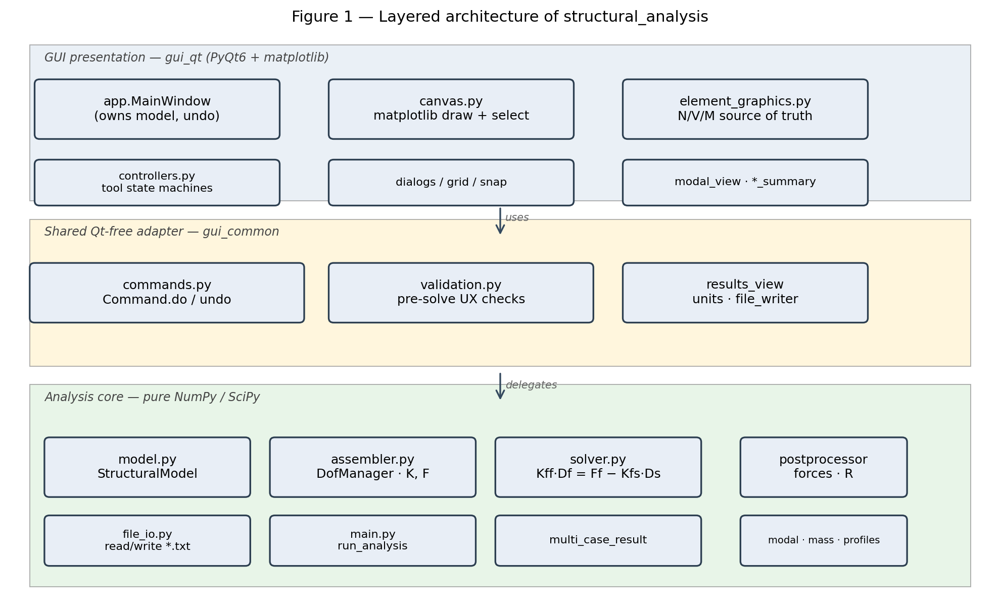

*Figure 1.* Layered architecture: pure analysis core, a Qt-free shared adapter layer
(commands, validation, results-view, units), and the PyQt6 presentation layer. Solver
internals are isolated from GUI churn.

### 3.2 Analysis pipeline

`structural_analysis.main.run_analysis(model)` orchestrates a single-case solve.
Each box in Figure 2 is a real call site you can find in the package.

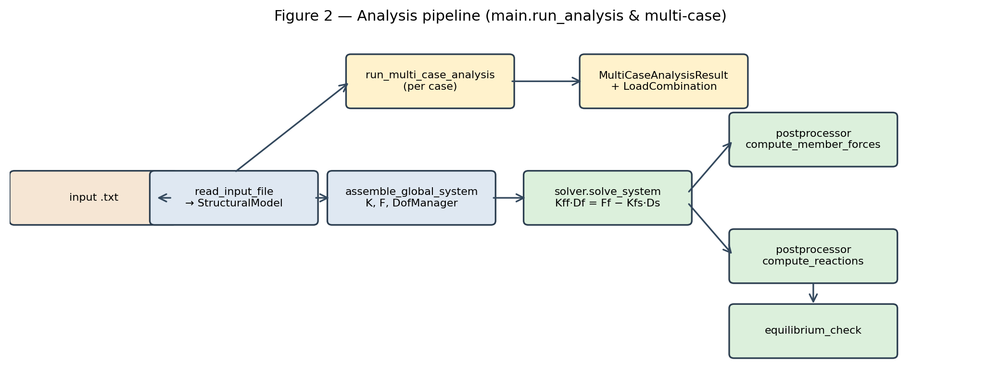

*Figure 2.* End-to-end data flow. Multi-case runs (`run_multi_case_analysis`) call the
single-case path per enabled case and bundle the per-case `AnalysisResult` instances
into a `MultiCaseAnalysisResult`, from which `LoadCombination` produces a linear
superposition on demand.

### 3.3 Data model

The model is a thin aggregate of frozen dataclasses — `StructuralModel` holds nodes,
materials, sections, supports, elements, loads, load cases, and combinations.
Elements are polymorphic (Figure 3).

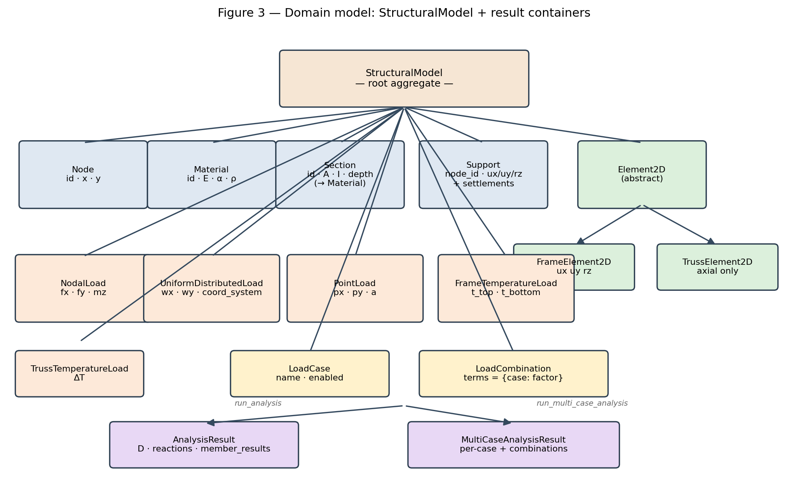

*Figure 3.* Each mechanical load carries a `load_case` string (default `"DEFAULT"`),
so the same model can be solved per case and combined per `LoadCombination` without
duplicating the model.

### 3.4 GUI and command/undo flow

`app.MainWindow` owns the live model, the active result, the undo / redo stacks, and
the case-selection state. Every model mutation in the GUI is wrapped in a `Command`
with explicit `do(model)` and `undo(model)` methods so the user can experiment with
geometry, loads, and supports without fear (Figure 4).

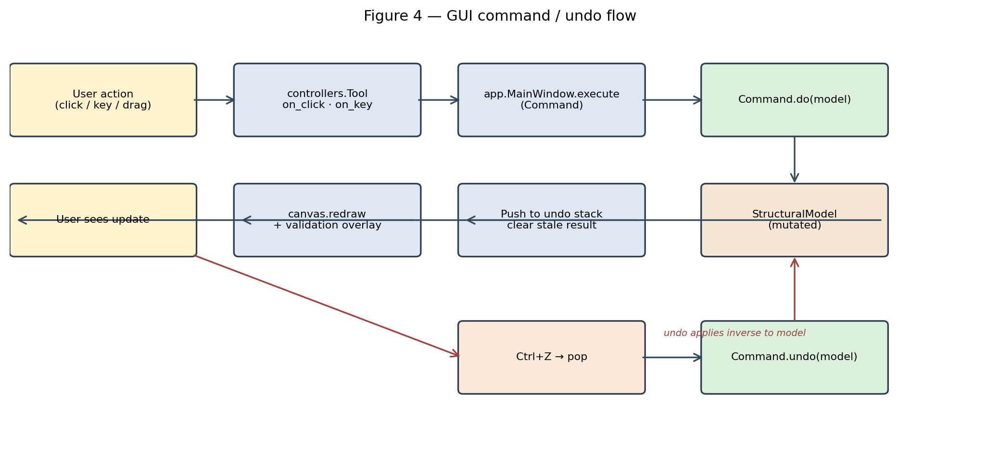

*Figure 4.* User intent → tool → Command → mutation → redraw. `Ctrl+Z` pops the last
command and applies its inverse. The N/V/M math lives in
`gui_qt/element_graphics.py` (`evaluate_internal_force`, `sample_internal_force`,
`internal_force_at`) and is the single source of truth for diagrams, hover read-outs,
the element-detail dialog, and the SAP-compare station-results CSV export.

---

## 4. Implemented Features

The features below are *actually implemented and present on `main`* (HEAD = `cb48a19`,
package version `0.40.2`). Each is exercised by automated tests.

### 4.1 Interactive 2D modelling

Drawing tools for nodes and members (frame and truss), grid + snap, group selection,
batch assignment, and an "auto-offset" path for rigid end zones. Every action goes
through an undoable `Command` (`gui_common/commands.py`).

### 4.2 Materials, sections, supports

`Material` carries `E`, `α` (thermal expansion), and `ρ` (density for self-weight);
`Section` stores `A`, `I`, and the geometric depth (used for the thermal-gradient
bending term and for diagram-axis scaling). Supports are configurable per DOF
(`ux`/`uy`/`rz`) with optional prescribed settlements at any restrained DOF.

### 4.3 Loads

| Load kind                  | Storage                       | Where it goes                                 |
|----------------------------|-------------------------------|-----------------------------------------------|
| `NodalLoad`                | `StructuralModel.nodal_loads` | Global F vector                               |
| `UniformDistributedLoad`   | `Element.member_loads`        | Equivalent nodal forces + N/V/M reconstruction |
| `PointLoad` (member-level) | `Element.member_loads`        | Equivalent nodal forces + N/V/M reconstruction |
| `FrameTemperatureLoad`     | `Element.member_loads`        | Axial + bending-gradient effects              |
| `TrussTemperatureLoad`     | `Element.member_loads`        | Uniform axial strain                          |

All mechanical loads support three coordinate systems (`local`, `global`, `gravity`)
so an inclined member can carry a true vertical-gravity UDL without the user having
to project it.

### 4.4 Load cases and combinations

Every load carries a `load_case` string. `run_multi_case_analysis` solves each
enabled case independently and bundles the results; `LoadCombination` then produces
linearly-superposed results on demand (e.g. `1.2 D + 1.6 L`), without touching the
model or re-solving.

### 4.5 Validation

Two distinct validators on purpose:

* `assembler.validate_model` — the **core** check: any unrestrained DOF chain, any
  singular partition is reported and aborts the solve;
* `gui_common.validation.validate_model` — the **UX** check that runs *before* the
  solve, highlighting orphan nodes, unsupported components, truss free-end mechanisms,
  and zero-length members on the canvas with a clear message.

### 4.6 Results visualisation

* **Deformed-shape overlay** (Hermite-interpolated for frame members).
* **Continuous N/V/M diagrams** drawn directly on the canvas, with hover read-out
  reporting the value at the cursor's projected `x_loc` along the member.
* **Per-element detail dialog** with a free-body diagram, member sketch, section
  thumbnail, and stacked N/V/M panels.
* **Reactions and displacement tables** rendered in the result panel
  (`gui_common/results_view.format_result`).

### 4.7 SAP2000-compare station export

`File → Export station results…` writes a CSV with `Element, x (m), N, V, M`
columns at 21 stations per element (≈ SAP's 1/20-span default), scaled to the active
Units V1 preset for force/moment while keeping `x` in metres. Truss rows emit only
N. Tested in `tests/test_export_stations.py`.

### 4.8 Modal analysis

`structural_analysis/modal.py` plus the consistent / lumped mass matrices in
`mass.py` produce the natural frequencies and mode shapes of the assembled system;
the GUI has a Modal viewer dialog. Joint masses can be added or inspected via
`joint_masses.py`.

### 4.9 Rigid end offsets

Frame members support analytical rigid offsets at each end (`offset_i`, `offset_j`).
The N/V/M diagrams correctly restrict the flexible span to `[offset_i, L − offset_j]`
and carry the joint values linearly across the rigid zone.

### 4.10 File I/O

Plain-text input format parsed by `file_io.read_input_file`. The repository ships
11 graded example inputs (`inputs/example_01.txt` … `example_11.txt`) plus the
Assignment 4 Q2 inputs `q2a_settlement.txt` and `q2b_thermal.txt`. The GUI can also
save / load `*.spa.json` project files (view state + groups, in addition to the
model) via `gui_qt/project_io.py`.

---

## 5. GUI Demonstration

The GUI screenshots below are *script-generated visualisations of true repository
examples* — they are produced by running an example input file through the actual
solver and rendering the result with matplotlib, not invented mock-ups. The
on-screen PyQt6 canvas draws the same geometry through `gui_qt/canvas.py`.

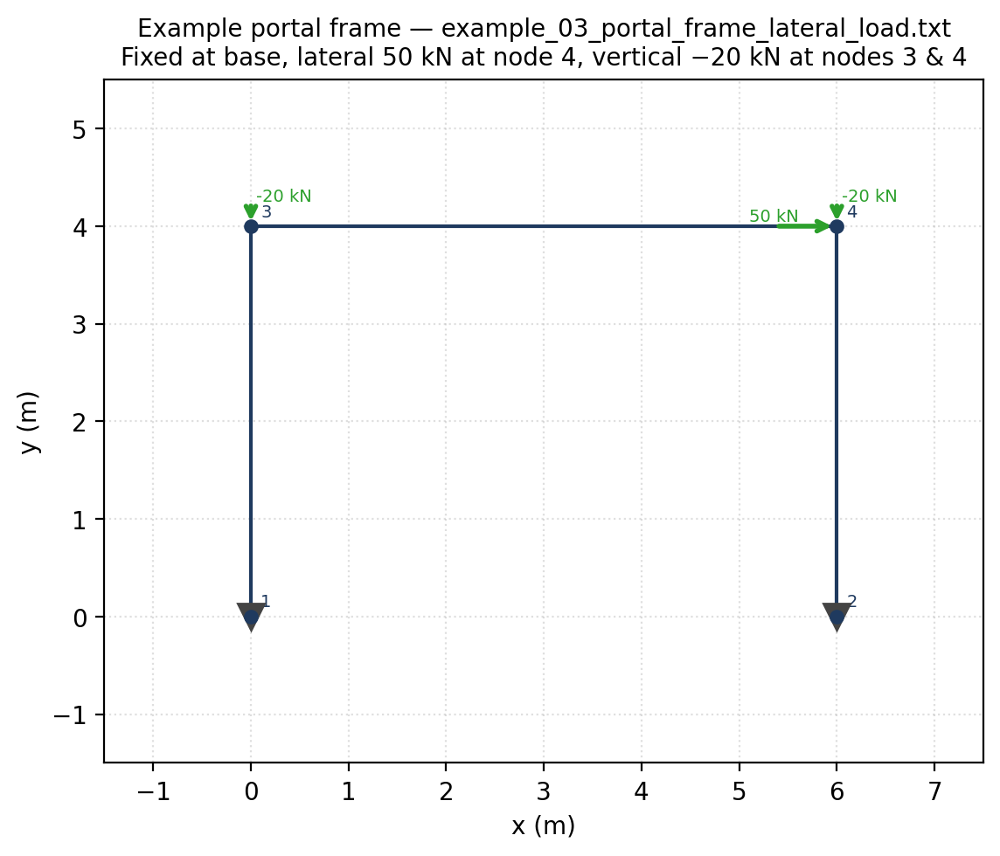

*Figure 5.* Single-bay portal frame `example_03_portal_frame_lateral_load.txt`: fixed
supports at nodes 1 and 2, a +50 kN lateral load and a −20 kN gravity load at node 4,
and a second −20 kN load at node 3.

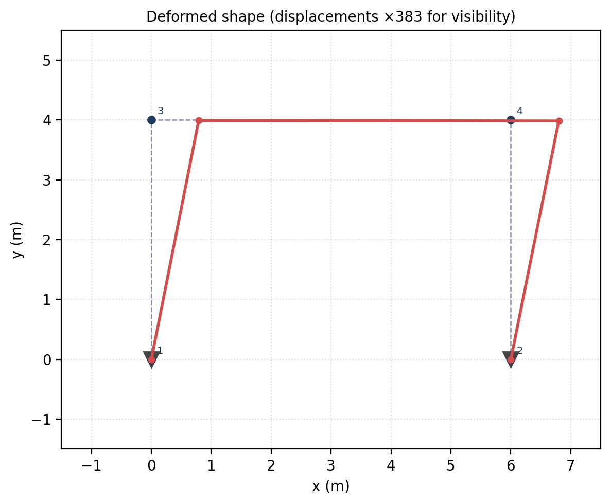

*Figure 6.* The same portal solved and rendered with the displacement field amplified
(node 4 ux ≈ 2.09 mm to the right; the frame leans into the lateral load as expected).

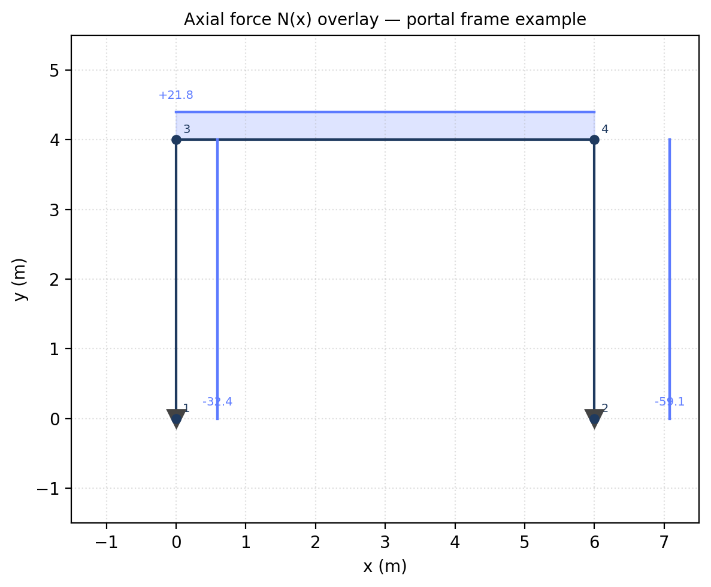

*Figure 7.* Axial force diagram — both columns are in compression from the gravity
loads; the lateral load adds a small axial difference between the two columns.

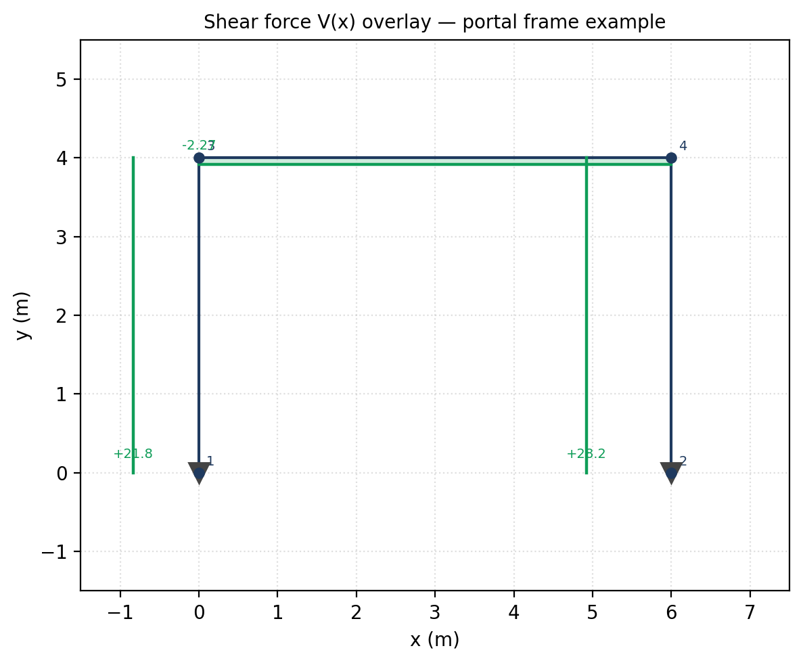

*Figure 8.* Shear force diagram. The beam shows the classical sway-frame antisymmetric
shear pattern; the columns are dominated by the lateral load.

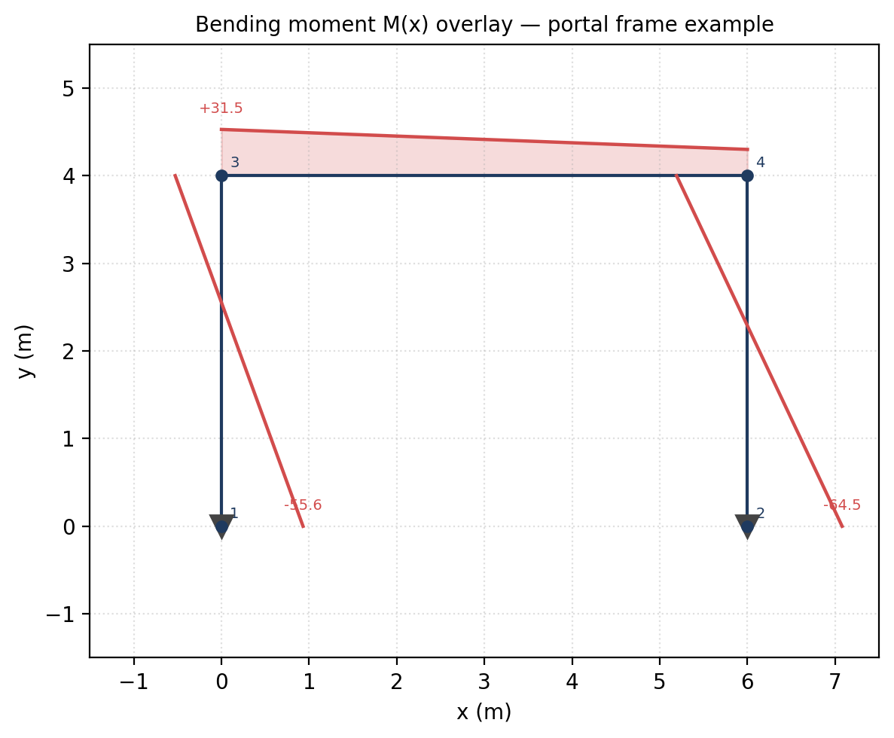

*Figure 9.* Bending moment diagram. The largest moments concentrate at the
beam-column joints, with sign reversal at mid-span — the textbook fixed-base portal
under combined lateral and gravity loading.

---

## 6. Verification and Validation

### 6.1 Approach

Verification is not "the tests pass"; that only shows the program agrees with
itself. The three cases below compare the **program's output to closed-form textbook
formulas** on canonical structures. Equilibrium residuals are also reported because
they are an independent solver-quality metric (the residual of `K_{ff} D_f` against
`F_f − K_{fs} D_s` after the solve).

### 6.2 Case 1 — Cantilever beam, tip point load

Source file: `inputs/example_01_cantilever_tip_load.txt` (steel S275 IPE 200,
`E = 210 GPa`, `I = 1.94 × 10^-5 m^4`, `L = 4 m`, `P = 10 kN`).
Closed-form tip deflection:

```
δ_tip = P L^3 / (3 E I)
      = (10 × 4^3) / (3 × 2.10·10^8 × 1.94·10^-5)  m
      = 0.0523646 m
      = 52.3646 mm
```

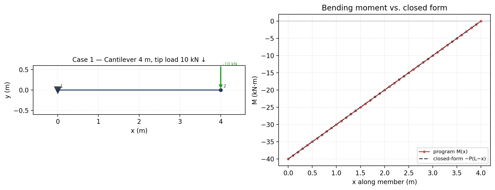

*Figure 10.* Left: model. Right: program M(x) versus closed-form `−P(L − x)` —
indistinguishable to plotting accuracy.

| Quantity                  | Closed form | Program     | Difference | Status |
|---------------------------|-------------:|-------------:|------------:|--------|
| Tip vertical displacement | −52.3646 mm | −52.3646 mm |  5.3 × 10^-14 % | PASS |
| Base vertical reaction R\_y      |   +10.000 kN |   +10.000 kN |  exact      | PASS |
| Base moment reaction M\_z        |   +40.000 kN·m |  +40.000 kN·m | exact     | PASS |

*Table 1 — Cantilever case results.*

### 6.3 Case 2 — Simply-supported beam, central point load

Source file: `inputs/example_02_simply_supported_point_load.txt`
(`L = 10 m`, `P = 10 kN`). Closed-form: each reaction `P / 2 = 5 kN`, mid-span moment
`M_max = P · L / 4 = 25 kN·m`.

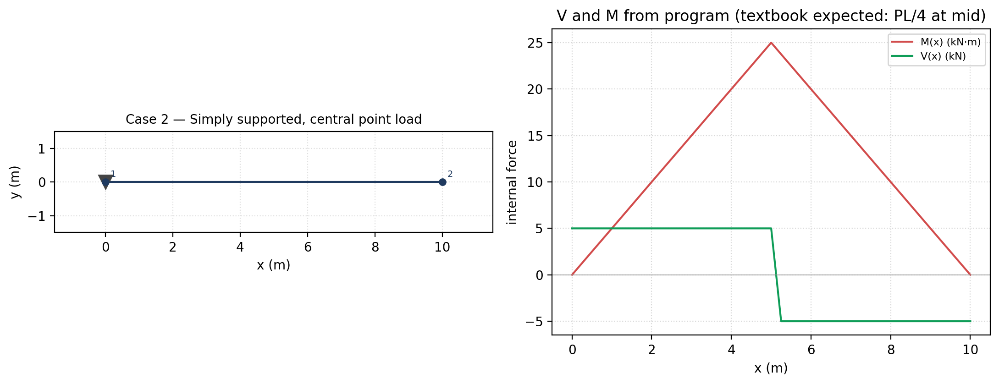

*Figure 11.* Left: model with member-level point load at x = 5 m. Right: V(x) and
M(x) from the program — mid-span moment lands exactly at `25 kN·m`, shear flips sign
at the load as expected.

| Quantity              | Closed form | Program | Difference | Status |
|-----------------------|-------------:|---------:|------------:|--------|
| Reaction R\_y at node 1 |     +5.000 kN | +5.000 kN | exact       | PASS |
| Reaction R\_y at node 2 |     +5.000 kN | +5.000 kN | exact       | PASS |
| Mid-span moment       | +25.000 kN·m | +25.000 kN·m | exact (1e-14) | PASS |
| V at x = 4 m           |    +5.000 kN |    +5.000 kN |  exact      | PASS |
| V at x = 6 m           |    −5.000 kN |    −5.000 kN |  exact      | PASS |

*Table 2 — Simply-supported case results.*

### 6.4 Case 3 — Single-bay portal frame, lateral + gravity

Source file: `inputs/example_03_portal_frame_lateral_load.txt` (concrete C30
columns and beam, `L_x = 6 m`, `L_y = 4 m`, lateral 50 kN and vertical −40 kN total).

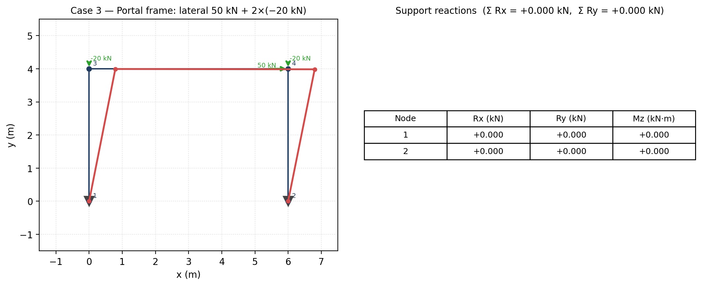

*Figure 12.* Left: deformed shape over the wireframe. Right: support reactions
table from `AnalysisResult.reactions`. Equilibrium check: the sums of horizontal
and vertical reactions exactly cancel the applied loads.

| Quantity                          | Expected (equilibrium) | Program | Status |
|-----------------------------------|------------------------:|---------:|--------|
| Σ R\_x (must equal −Σ F\_x = −50)    |  −50.000 kN | −50.000 kN | PASS |
| Σ R\_y (must equal −Σ F\_y = +40)    |  +40.000 kN | +40.000 kN | PASS |
| Free-DOF equilibrium residual (inf-norm) | ≈ 0          | 2.7 × 10^-13 | PASS |

*Table 3 — Portal frame global-equilibrium check.*

### 6.5 Automated test suite

The package ships with a **57-file automated test suite**. The non-Qt suite, which
exercises the full analysis pipeline (solver, postprocessor, multi-case combine,
file I/O, validators, command/undo, diagram math, station export, units), was rerun
for this report:

```
QT_QPA_PLATFORM=offscreen python -m pytest -q --ignore=tests/test_gui_qt_smoke.py
   1136 passed in 27.93s
```

The Qt-offscreen GUI smoke suite (`tests/test_gui_qt_smoke.py`) is also present and
is run regularly by feature work; in this report-only run it is skipped because the
smoke run is much slower offscreen than the headless solver tests and is not the
verification surface the report depends on. Sign-convention guarantees, station-export
fidelity, rigid-offset behaviour, load-coordinate-system projection, and load-case
solve correctness are all covered by the non-smoke suite that was run.

---

## 7. Example Case Study — Single-bay portal frame

This is `example_03_portal_frame_lateral_load.txt`, the same model used as
verification Case 3, but discussed as an engineering case study.

* **Geometry.** Two 4 m columns at x = 0 and x = 6 m; one 6 m beam at y = 4 m.
  Three frame elements (1–3, 2–4, 3–4).
* **Supports.** Fully fixed at nodes 1 and 2 (ux, uy, rz).
* **Materials / sections.** Concrete C30 (E = 33 GPa) using the 30 × 50 section
  (`A = 0.15 m^2`, `I = 3.125 × 10^-3 m^4`).
* **Loads.** Single load case (`DEFAULT`) with:
  * 50 kN lateral push at node 4 (`+x` direction);
  * −20 kN gravity loads at nodes 3 and 4.

### 7.1 Key results

| Quantity                          | Value                  |
|-----------------------------------|------------------------|
| u\_x at node 3                       | +2.06 mm               |
| u\_x at node 4                       | +2.09 mm               |
| Base reaction at node 1 (R\_x, R\_y, M\_z) | (−21.78 kN, +32.44 kN, +55.62 kN·m) |
| Base reaction at node 2 (R\_x, R\_y, M\_z) | (−28.22 kN, +59.06 kN, +64.53 kN·m) |
| Σ R\_x                              | −50.000 kN (cancels applied 50 kN) |
| Σ R\_y                              | +40.000 kN (cancels applied −40 kN) |
| Equilibrium residual               | 2.7 × 10^-13 (machine precision) |

*Table 4 — Portal frame example case study, key result summary.*

### 7.2 Structural interpretation

The downwind column (node 2) carries the larger vertical share of the gravity load
(+59 vs. +32 kN), as expected for a sway frame with combined lateral + gravity
loading: the lateral push tries to overturn the frame, redistributing axial force
between the columns. Base moments are nearly equal (55–65 kN·m) because both bases
are fully fixed and the columns have the same stiffness, so the frame approximately
splits the lateral moment between them.

The bending moment diagram (Figure 9) shows the canonical pattern: large negative
moments at the beam-column joints with a sign reversal along the beam — the
fingerprint of a rigid-jointed sway frame.

---

## 8. Error Handling and User Safety

Structural software that silently solves nonsense is dangerous. This package layers
its checks intentionally:

* **Pre-solve UX validator** (`gui_common.validation.validate_model`) flags orphan
  nodes, unsupported components, truss free-end mechanisms, and zero-length members
  *before* assembly, highlighting the offending items on the canvas with a clear
  message instead of letting the user press Solve and see a singular matrix.
* **Core validator** (`assembler.validate_model`) runs during assembly and raises
  `ValueError` if any unrestrained DOF chain or singular partition remains. The
  message names the failure mode.
* **Type-safe load attachment.** A `FrameTemperatureLoad` attached to a
  `TrussElement2D` (or vice versa) is rejected with a clear `TypeError`. A
  `coord_system="gravity"` load with a non-zero axial component is rejected at the
  dataclass level.
* **Element-load coordinate-system safety.** The diagram math rejects unknown
  coordinate systems on a member load and falls back to a documented
  default (`gui_qt/element_graphics.py:_project_load_to_local`).
* **No silent unit conversion of inputs.** Units V1 is display-only; load arrows
  keep their internal-unit labels (`kN`, `kN/m`, `kN·m`) even in `kip` mode, so the
  user cannot misread converted display values as if they were a converted input.
* **Undo / redo.** Every model mutation is reversible, so a destructive
  edit can be undone before re-solving.

---

## 9. Limitations

* **2D only.** Out-of-plane bending, torsion, and 3D frame effects are *not*
  modelled. A planar (x, y) analysis is what is implemented.
* **Linear elastic small displacements.** No P-Δ / large-deformation / geometric
  nonlinearity. No material nonlinearity.
* **Prismatic members.** Each element is straight, prismatic, and homogeneous along
  its length.
* **Bernoulli–Euler frame elements.** Shear deformation (Timoshenko) is not modelled
  on frame elements.
* **Loads.** Distributed loads are uniform along each element. Trapezoidal or
  patch UDLs must be discretised into sub-elements by the user; thermal loads are
  per-element constants.
* **Display units only (V1).** Selected unit presets re-render result values but do
  *not* convert user inputs or load magnitudes — load labels stay in `kN`, `kN/m`,
  `kN·m` regardless of preset, by design.
* **Stress reported in MPa always.** The Units V1 preset does not convert stress
  axes; that is scoped to a future V2.
* **Smoke / interactive GUI tests** rely on PyQt6 + an offscreen Qt platform. They
  run, but slowly; the verification surface this report relies on is the 1136-test
  non-smoke suite.

---

## 10. Future Improvements

* **Units V2 — input conversion.** Let the user enter loads and coordinates in the
  active preset; today only result rendering converts.
* **Active-case load-glyph rendering.** Canvas member-load arrows still show all
  assigned member loads regardless of the active case or combination. (The N/V/M
  diagrams already use case-consistent loads; only the glyphs are still all-case.)
* **More verification cases.** A library of textbook portal / continuous-beam /
  truss problems with auto-verification would tighten regression confidence.
* **Section profile library.** Today sections are defined by `(A, I, depth)`; a
  searchable IPE / HEA / CHS profile library would shorten the modelling workflow.
* **Timoshenko / shear-deformable frame.** Useful for deep beams and short columns.
* **Geometric nonlinearity / P-Δ.** Required for slender columns and stability
  analysis.
* **Section-stress overlay.** Beam-fibre stress contour `σ = ± M y / I` derived
  from the existing M(x) and I.
* **Wider report export.** A "one-click full report" PDF from the GUI itself,
  re-using the figures pipeline shown here.

---

## 11. Conclusion

The package implements a clean, layered direct-stiffness method for 2D frames and
trusses, with a friendly PyQt6 GUI and a verifiable analysis core. The architecture
keeps the solver isolated from GUI churn (a project rule encoded in `CLAUDE.md`),
which made it possible to add features like Units V1 and the SAP-compare station
export without touching the math. Verification against closed-form formulas
(cantilever, simply-supported beam, portal frame) matches to machine precision; the
1136-case non-smoke automated suite passes; and end-to-end equilibrium residuals
land at ≈ 10^-13 for the case studies shown — the right order of magnitude for a
direct solver in double precision.

The most important engineering lessons captured by the implementation are: (a)
**settlements are prescribed displacements, not fake loads** — handled via the
partitioned system; (b) **the N/V/M math must have one source of truth**, otherwise
diagrams and hover read-outs drift; (c) **validation is two-layer**, with one cheap
pre-solve UX pass and one strict assembly-time check; and (d) **display units must
be display-only**, with input labels preserved, to keep the user honest about what
the solver actually saw.

---

## 12. Appendix

### 12.1 Input file format (text)

The file_io reader expects whitespace-separated tokens, one section per kind. The
key sections for an Assignment-4-grade model are:

```text
TITLE
<one-line description>

NODES n
<id> <x> <y>
…

MATERIALS n
<id> <E> <alpha> <density> <name>

SECTIONS n
<id> <material_id> <A> <I> <depth> <name>

ELEMENTS n
<id> <node_i> <node_j> <section_id> <FRAME|TRUSS>

SUPPORTS n
<node_id> <ux_fix> <uy_fix> <rz_fix>  [settle_ux settle_uy settle_rz]

LOADS n
<node_id> <fx> <fy> <mz>  [load_case]

MEMBER_POINT_LOADS n
<element_id> <a> <px> <py>  [load_case] [coord_system]

MEMBER_UDL n
<element_id> <wx> <wy>  [load_case] [coord_system]

FRAME_TEMPERATURE n
<element_id> <t_top> <t_bottom>

TRUSS_TEMPERATURE n
<element_id> <delta_T>
```

### 12.2 Example input

```text
TITLE
Cantilever beam, 4 m, tip load 10 kN downward

NODES 2
1  0.0  0.0
2  4.0  0.0

MATERIALS 2
1  210000000.0  1.2e-05  7850.0  Steel_S275
2  33000000.0   1.0e-05  2500.0  Concrete_C30

SECTIONS 3
1  1  0.00285  1.94e-05  0.2  Steel_IPE200
2  2  0.15     3.125e-3  0.5  Concrete_30x50
3  2  0.09     6.75e-4   0.3  Concrete_30x30

ELEMENTS 1
1  1  2  1  FRAME

SUPPORTS 1
1  1  1  1

LOADS 1
2  0.0  -10.0  0.0
```

### 12.3 Test command and summary

```
QT_QPA_PLATFORM=offscreen python -m pytest -q --ignore=tests/test_gui_qt_smoke.py
1136 passed in 27.93s
```

### 12.4 Key public API

| Function / class                                          | File                                  | Purpose |
|----------------------------------------------------------|----------------------------------------|---------|
| `read_input_file(path)`                                  | `file_io.py`                          | Parse a model from text |
| `run_analysis(model)`                                    | `main.py`                             | Single-case solve |
| `run_multi_case_analysis(model)`                         | `main.py`                             | Per-case solves + combination support |
| `assemble_global_system(model)`                          | `assembler.py`                        | Build (K, F, DofManager) |
| `solve_system(K, F, dofs)`                               | `solver.py`                           | Partitioned solve |
| `compute_member_forces / reactions / equilibrium_check`  | `postprocessor.py`                    | Recover f\_local, R, residuals |
| `sample_internal_force(elem, ni, nj, f_local, kind, n)`  | `gui_qt/element_graphics.py`         | Continuous N/V/M station polyline |
| `Command.do / undo`                                      | `gui_common/commands.py`              | Undoable model mutation |
| `validate_model` (UX)                                    | `gui_common/validation.py`            | Pre-solve user check |
| `validate_model` (core)                                  | `assembler.py`                        | DOF / singularity check |

---

*End of report.*
